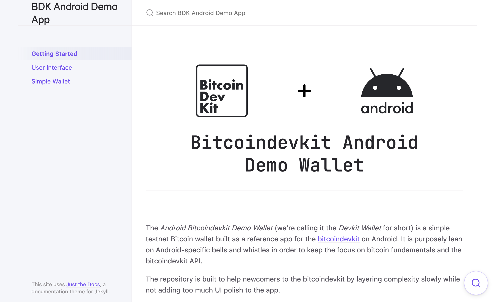

# Bitcoindevkit Android Demo Wallet

The _Android Devkit Demo Bitcoin Wallet_ (we're calling it _Devkit Wallet_ for short) is a simple testnet Bitcoin wallet built as a reference app for the [bitcoindevkit](https://github.com/bitcoindevkit) on Android. It is purposely lean on Android-specific bells and whistles in order to keep the focus on bitcoin fundamentals and the bitcoindevkit API.

The repository is built to help newcomers to the bitcoindevkit by layering complexity slowly while not adding too much UI polish to the app.

The repository works in the following way: multiple branches are maintained in parallel, each of them focusing on a specific version of the app.
1. the default branch is the `simple-wallet` branch. It builds a simple bitcoin wallet which implements the core functionality one would expect from a wallet: create addresses, send, receive, display transaction history, and BIP84-compatible wallet recovery.
2. the `ui` branch builds the basic design and UI without any functionality
3. the `docs` branch is mostly empty and is used for docs

 

## Companion Documentation Website

    

You can find the companion tutorial website for this repository [here](https://thunderbiscuit.github.io/bitcoindevkit-android-sample-app/). To learn more about the bitcoindevkit, check out [the shiny new docs here](https://bitcoindevkit.org/).

 

## First Time Building on Android?
If it's your first time working with Android apps or the bitcoindevkit android library, you can start by building this [initial test app](https://github.com/thunderbiscuit/android-bdk-development-testapp), which will ensure your local setup is up and running, ready to get started for development and exploration on the various apps here.
