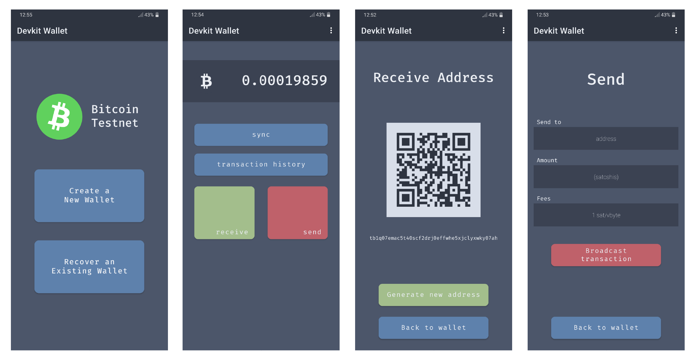
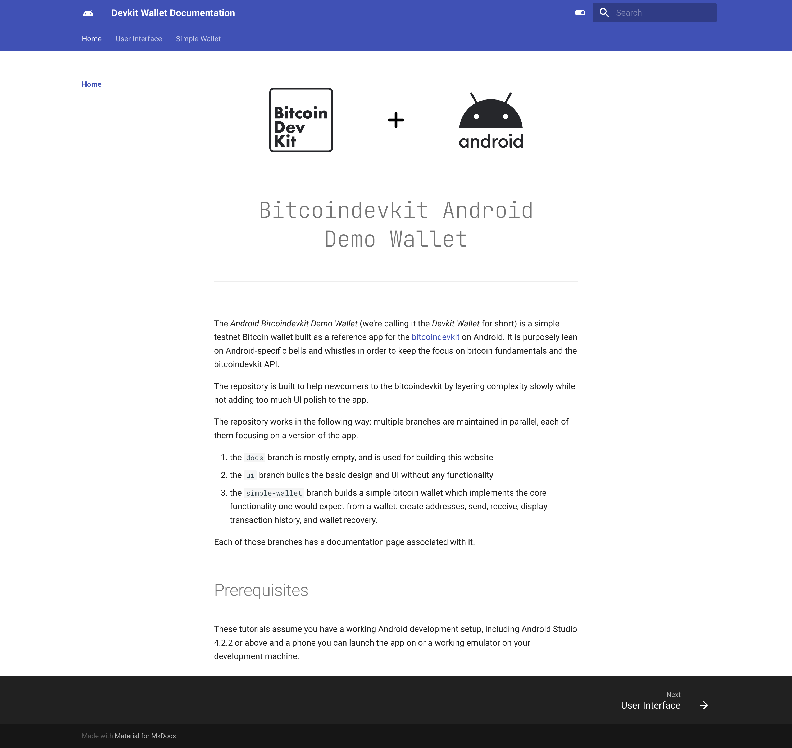

# Bitcoindevkit Android Demo Wallet

    

The _Android Devkit Demo Bitcoin Wallet_ (we're calling it _Devkit Wallet_ for short) is a simple testnet Bitcoin wallet built as a reference app for the [bitcoindevkit](https://github.com/bitcoindevkit) on Android. It is purposely lean on Android-specific bells and whistles in order to keep the focus on bitcoin fundamentals and the bitcoindevkit API.

The repository is built to help newcomers to the bitcoindevkit by layering complexity slowly while not adding too much UI polish to the app.

The repository works in the following way: multiple apps are maintained in parallel, each of them focusing on a specific version of the app.
1. The default app is [simple-wallet](./app-simple-wallet/). It builds a simple bitcoin wallet which implements the core functionality one would expect from a wallet: create onchain addresses, send, receive, display transaction history, and wallet recovery. It builds BIP-84 (P2PKH) compatible wallets.
2. The [advanced-features](./app-advanced-features/) app showcases the more advanced features of the library.
3. The [ui](./app-ui-only/) app builds the basic design and UI without any bitcoin-related functionality.

 

## Feature list
### `simple-wallet` app
- [x] Receive
- [x] Send
- [x] Sync wallet using Electrum
- [x] Retrieve transaction history
- [x] Wallet recovery using BIP39 recovery phrases

### `advanced-features` app
- [x] Send to multiple recipients
- [x] "Send All" functionality
- [x] Replace-by-Fee (BIP125)
- [x] Choose custom Electrum server
- [x] Create OP_RETURN outputs
- [ ] Partial signatures on PSBTs

 

## Design Choices
The Devkit Wallet makes rather opinionated choices regarding its design and architecture, all with the goal of being as helpful to potential bitcoindevkit developers exploring the library and looking for a working example. The end users of this application are developers, not real users. Here are some of these choices:
1. Be lean on Android-specific bells and whistles.
2. Return types are explicitly stated for all code that touches bitcoin, even when the IDE doesn't like it.
3. Some bugs are left in and considered acceptable if squashing them requires a lot of polish/boilerplate code that does not add to the understanding of the Bitcoin Development Kit.
4. Errors are not always communicated back to the user on-screen (for example through polished snackbars) for similar reasons as (3); if something is not working, take a look a the logcat output.
5. The wallet does not make use of string resources. This makes the codebase easier to search and simpler to parse on GitHub and platforms where the IDE doesn't show inline replacements of the string resources. In short, string resources, while a best practice, do not improve readability, the prime focus of theses sample applications.

 

## Companion Documentation Website

    

You can find the companion tutorial website for this repository [here](https://thunderbiscuit.github.io/devkit-wallet/). Note that as of 2023, the website is fairly outdated. If you find it useful and are looking to contribute, I would happily merge updates to the tutorial website!

To learn more about the bitcoindevkit, check out [the official website here](https://bitcoindevkit.org/).
