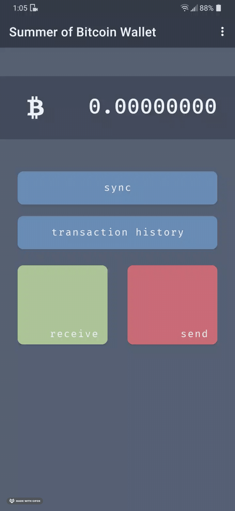
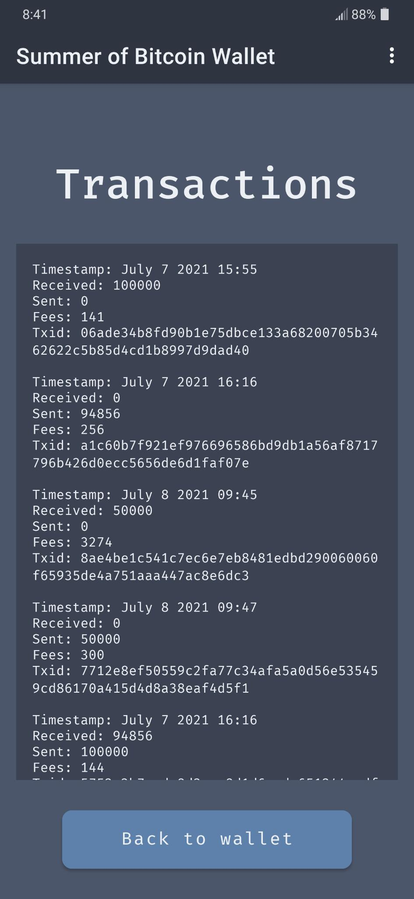
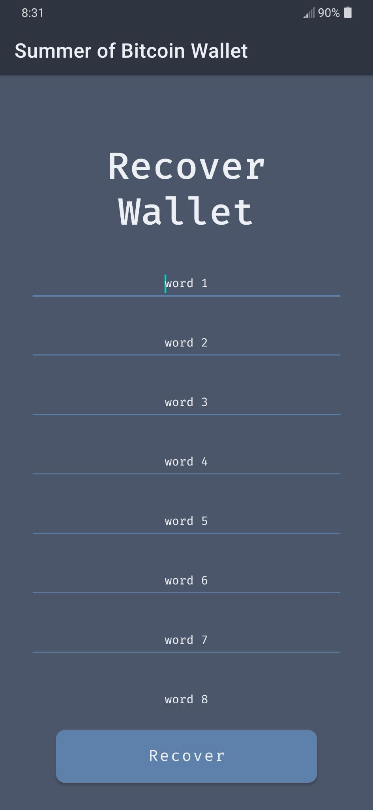

# Building a Simple Testnet Wallet
This page is the second part of a walkthrough tutorial of the [DevKit Wallet codebase](https://github.com/thunderbiscuit/devkit-wallet).

Note that this page concerns itself with the `simple-wallet` branch of the repository.

We break the journey of building the wallet into 6 distinct steps:
1. Create a Wallet object with the Repository design pattern
2. Implement receive and sync functionalities
3. Implement send functionality
4. Query and display transaction history
5. Display recovery phrase
6. Implement wallet recovery from BIP39 words

# Task 1: Add Wallet and Repository objects
This is where things get interesting on the bitcoin side of things. This task introduces 2 new objects: the `Wallet` object and the `Repository` object.

Both are initialized on startup by the `DevkitWalletApplication` class, with some properties they need to function (wallet path and shared preferences respectively).

## Wallet object
The `Wallet` class is our window to the bitcoindevkit. It's the only class that interacts with the bitcoindevkit directly and you'll find in there most of the API. Methods like `createWallet()`, `loadExistingWallet()`, and `recoverWallet()` allow you to generate/recover wallets on startup, and methods like `sync()`, `getNewAddress()`, and `getBalance()` provide the necessary interactions one would expect from a bitcoin wallet library.

## Repository object
The _Repository_ design pattern is common in Android applications. The idea is to create a layer of separation between the UI (activities, fragments) and the data they need to function. A `Repository` class is often used as the bridge between the two. For example, a composable might need to display a list of friends the user has, and that list might be available from different locations (say a ping to a microservice, or a lookup in a local cache). It's important to pull that sort of decision/code away from UI components. This is typically the sort of thing that the repository will do; make decisions as to where and how to get data for the UI fragments that request it.

For us this shows up when the `DevkitWalletActivity` tries to decide if the user already has a wallet initialized upon launch. In this case the activity simply asks the `Repository` the question
```kotlin
Repository.doesWalletExist()
```
and doesn't care how the Repository knows (in this example the repository uses a boolean value stored in [shared preferences](https://developer.android.com/training/data-storage/shared-preferences)). Shared preferences are a way to store small amounts of data quickly without requiring a database. Common use cases are small strings and booleans (like choice of color theme, whether something has been completed, etc.).

## Using the bitcoindevkit
We can see the library in action through the logs, for example when creating a new wallet, generating new addresses, and syncing. Log statements are scattered through the app and look like this:
```kotlin
Log.i(TAG, "Loading existing wallet, descriptor is ${initialWalletData.descriptor}")
```
<br/>

# Task 2: Implement receive and sync
It's now time to connect the `Wallet` object to the user interface. Note how the "generate new address" button has an on `onClick` parameter that triggers the `updateAddress()` method on the viewmodel:
```kotlin
// ReceiveScreen.kt

Button(
    onClick = { addressViewModel.updateAddress() },
    colors = ButtonDefaults.buttonColors(DevkitWalletColors.auroraGreen),
    shape = RoundedCornerShape(16.dp),
) {
    Text(
        text = "generate new address",
        fontSize = 14.sp,
    )
}
```

This viewmodel in turns calls the `Wallet.getLastUnusedAddress()`, which itself is a simple call to the bitcoin dev kit wallet object:
```kotlin
// Wallet.kt

object Wallet {
    // ...
    
    fun getLastUnusedAddress(): String = wallet.getLastUnusedAddress()
}
```

## QR codes
QR codes are generated using a library called zxing (you'll find the dependency in the `/app/build.gradle.kts` file).

## Sync
The sync functionality in Devkit Wallet is very simple (`Wallet.sync()` will do). The sync is a call to the blockstream testnet public Electrum server. But note that we also wish to update the UI to reflect the current balance upon sync, and this is done using something called the viewmodel, a very common pattern in Android applications. ViewModels are a way to implement the [observer pattern](https://www.youtube.com/watch?v=_BpmfnqjgzQ).

Take a look at the `WalletViewModel` class:
```kotlin
class WalletViewModel() : ViewModel() {

    private var _balance: MutableLiveData<ULong> = MutableLiveData(0u)
    val balance: LiveData<ULong>
        get() = _balance

    fun updateBalance() {
        Wallet.sync()
        _balance.value = Wallet.getBalance()
    }
}
```

Fragment and activities can simply "observe" (subscribe to) particular variables in our ViewModel, and the ViewModel will update them as this value changes. This ensures that the balance displayed in the composable is always up to date with the balance in the `WalletViewModel`. Easy peasy bitcoineesy.

<center>
  
</center>
<br/>

# Task 3: Implement send
Sending bitcoin is a slightly more involved operation.

The bitcoindevkit workflow for this operation is as follows:
1. Create a transaction (you'll need amount, fee rate, and a recipient's address)
2. Sign the transaction
4. Broadcast it

Note that all 3 of those steps are accomplished by the `broadcastTransaction()` method of the `SendScreen`:
```kotlin
private fun broadcastTransaction(recipientAddress: String, amount: ULong, feeRate: Float = 1F) {
    try {
        // create, sign, and broadcast
        val psbt: PartiallySignedBitcoinTransaction = Wallet.createTransaction(recipientAddress, amount, feeRate)
        Wallet.sign(psbt)
        val txid: String = Wallet.broadcast(psbt)
        Log.i(TAG, "Transaction was broadcast! txid: $txid")
    } catch (e: Throwable) {
        Log.i(TAG, "Broadcast error: ${e.message}")
    }
}
```

The required bitcoindevkit library calls inside the `Wallet` object are fairly simple:
```kotlin
    fun createTransaction(recipient: String, amount: ULong, fee_rate: Float?): PartiallySignedBitcoinTransaction {
        return PartiallySignedBitcoinTransaction(wallet, recipient, amount, fee_rate)
    }

    fun sign(psbt: PartiallySignedBitcoinTransaction): Unit {
        wallet.sign(psbt)
    }

    fun broadcast(signedPsbt: PartiallySignedBitcoinTransaction): String {
        return wallet.broadcast(signedPsbt)
    }
```
<br/>

# Task 4: Add transaction history
Adding a list of transactions to a wallet is a daunting task if one is to take it to a polished result. It involves using a database and keeping track of transactions, their state, and performing calculations on the raw material that the bitcoindevkit provides, and is slightly outside of the scope of this sample wallet. Simply displaying the list of transactions as one long string (with some small modifications), however, is quite easy, and this is what this wallet implements.

Note that the list of transactions is simply a string built by the `confirmedTransactionsList()` method and displayed in a `Text()` composable (same is true for pending transactions).

Creating the timestamp is the most involved part of this whole endeavour, and is done using a neat Kotlin feature called _extension functions_, where we define a method on the `ULong` type which returns a nicely formatted timestamp. Take a look at the `utilities/Timestamps.kt` file for more on this function. Building the string is otherwise a rather simple affair; the bitcoindevkit returns an object of type `List<Transaction>` through the `getTransactions()` method, and we iterate over them and pull the interesting components into a string template.

```kotlin
// TransactionsScreen.kt

// ...

Text(
    text = confirmedTransactionsList(allTransactions.filterIsInstance<Transaction.Confirmed>()),
    fontSize = 12.sp,
    fontFamily = firaMono,
    color = DevkitWalletColors.snow1
)

// ...

private fun confirmedTransactionsList(transactions: List<Transaction.Confirmed>): String {
    if (transactions.isEmpty()) {
        Log.i(TAG, "Confirmed transaction list is empty")
        return "No confirmed transactions"
    } else {
        val sortedTransactions = transactions.sortedByDescending { it.confirmation.height }
        return buildString {
            for (item in sortedTransactions) {
                Log.i(TAG, "Transaction list item: $item")
                appendLine("Timestamp: ${item.confirmation.timestamp.timestampToString()}")
                appendLine("Received: ${item.details.received}")
                appendLine("Sent: ${item.details.sent}")
                appendLine("Fees: ${item.details.fees}")
                appendLine("Block: ${item.confirmation.height}")
                appendLine("Txid: ${item.details.txid}")
                appendLine()
            }
        }
    }
}
```

<center>
  
</center>

<br/>

# Task 5: Display recovery phrase
Displaying the recovery phrase to the user is not a complicated task. Remember that we have stored the recovery phrase in shared preferences when creating the wallet
```kotlin
fun createWallet(): Unit {
    val keys: ExtendedKeyInfo = generateExtendedKey(Network.TESTNET, WordCount.WORDS12, null)
    val descriptor: String = createDescriptor(keys)
    val changeDescriptor: String = createChangeDescriptor(keys)
    initialize(
        descriptor = descriptor,
        changeDescriptor = changeDescriptor,
    )
    Repository.saveWallet(path, descriptor, changeDescriptor)
    Repository.saveMnemonic(keys.mnemonic)
}
```

Retrieving the recovery phrase is a simple call to the repository, which has a `getMnemonic()` method defined:
```kotlin
fun getMnemonic(): String {
    return sharedPreferencesManager.mnemonic
}
```

Upon creating the screen, the `getMnemonic()` method is simply called to populate series of text composables:
```kotlin
// RecoveryPhraseScreen.kt
@Composable
internal fun RecoveryPhraseScreen(navController: NavController) {

    val seedPhrase: String = Repository.getMnemonic()
    val wordList: List<String> = seedPhrase.split(" ")

    Scaffold(
        topBar = { AwayFromHomeAppBar(navController, "Recovery Phrase") },
    ) {
        Column(
            modifier = Modifier
                .fillMaxSize()
                .padding(all = 32.dp)
        ) {
            wordList.forEachIndexed { index, item ->
                Text(
                    text = "${index + 1}. $item",
                    modifier = Modifier.weight(weight = 1F),
                    color = DevkitWalletColors.snow1,
                    fontFamily = firaMono
                )
            }
        }
    }
}
```

<center>
  
</center>

# Task 6: Enable wallet recovery
Enabling wallet recovery is a matter of collecting a recovery phrase from the user and passing it to the bitcoindevkit, which will create our BIP32 root key from it.

The Devkit Wallet does not to much input cleaning, and mostly implements the "happy path" for wallet recovery in the spirit of keeping the sample application lean and easy to parse. Once the "Recover Wallet" button is pressed, we pass the list of words collected from the `OutlinedTextField` composables through the `buildRecoveryPhrase()` function:
```kotlin
// input words can have capital letters, space around them, space inside of them
private fun buildRecoveryPhrase(recoveryPhraseWordMap: Map<Int, String>): String {
    var recoveryPhrase = ""
    recoveryPhraseWordMap.values.forEach() {
        recoveryPhrase = recoveryPhrase.plus(it.trim().replace(" ", "").lowercase().plus(" "))
    }
    return recoveryPhrase.trim()
}
```

and give them to the Wallet object as a string.  
```kotlin
// Wallet.kt
fun recoverWallet(mnemonic: String) {
    val keys: ExtendedKeyInfo = restoreExtendedKey(Network.TESTNET, mnemonic, null)
    val descriptor: String = createDescriptor(keys)
    val changeDescriptor: String = createChangeDescriptor(keys)
    initialize(
        descriptor = descriptor,
        changeDescriptor = changeDescriptor,
    )
    Repository.saveWallet(path, descriptor, changeDescriptor)
    Repository.saveMnemonic(keys.mnemonic)
}
```

Note the use of the `restoreExtendedKey()` method where the mnemonic is passed to the bitcoindevkit, returning a object of type `ExtendedKeyInfo`, which contains the BIP32 root key (`ExtendedKeyInfo.xprv`).

<center>
  
</center>
