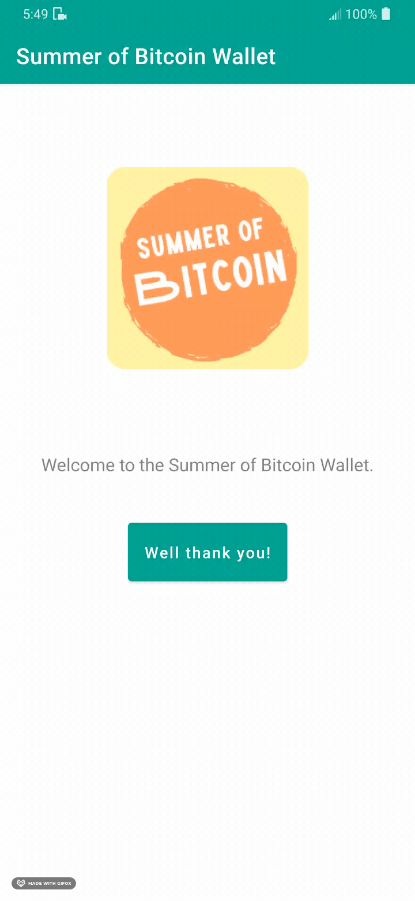
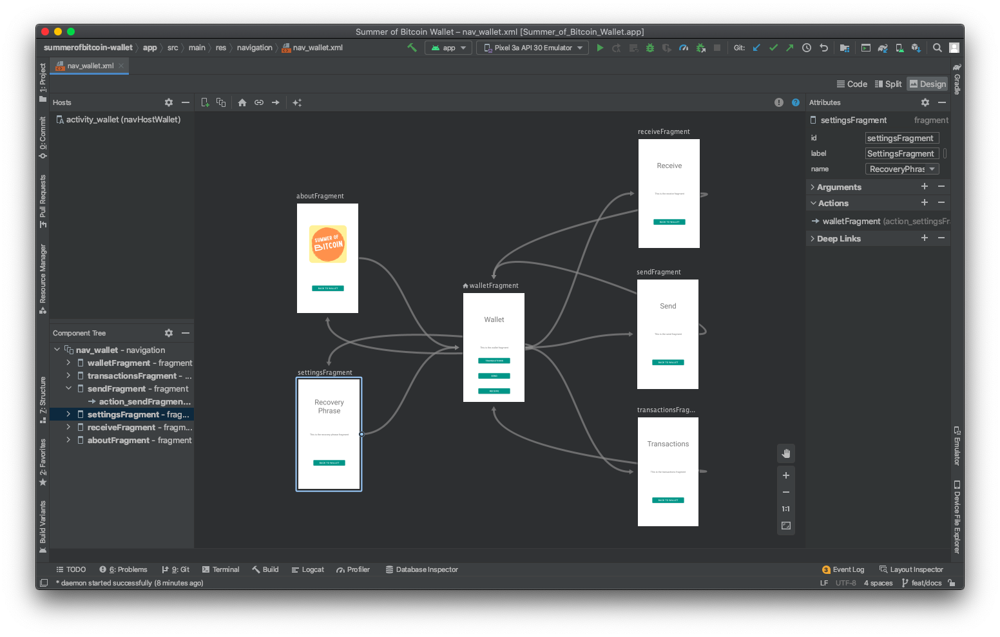
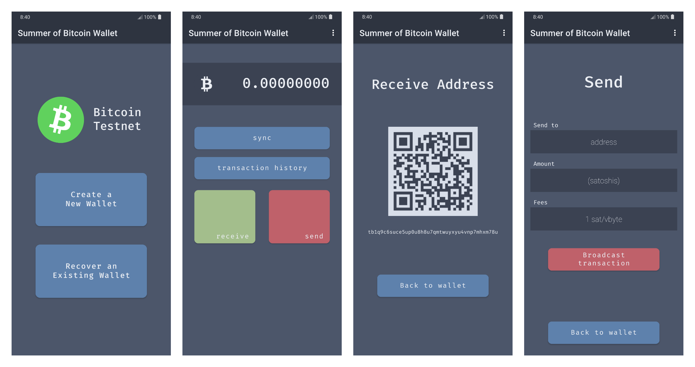

# Building the UI
This page is the UI part of a walkthrough tutorial of the [DevKit Wallet codebase](https://github.com/thunderbiscuit/bitcoindevkit-android-sample-app).

Note that this page concerns itself with the `ui` branch of the repository.

We break the journey of building the user interface for the wallet into 4 distinct steps:
1. Create a basic Android activity
2. Build multiple activities and navigate between them
3. Build fragments within the wallet activity (wallet, transaction history, receive, send, recovery phrase, about)
4. Build the target UI (layout files, colors, themes)

Each task is associated with a tag, and you can checkout the codebase at any of those tasks by checking out the associated tag (`git checkout task-ui1` for task 1 for example).

```sh
task-ui1           create a basic android activity
task-ui2           build multiple activities and navigate between them
task-ui3           add fragments to the wallet activity
task-ui4           build the target ui
```

# [Task 1](https://github.com/thunderbiscuit/bitcoindevkit-android-sample-app/tree/task-ui1): Create a basic Android activity

<center>
  
</center>

Our first tag is the easiest to accomplish yet one of the more complicated one to understand if you are new to Android. While the goal of this tutorial is not to teach the Android framework in depth, we nonetheless need to go over the main pieces of the puzzle at play here. Note that almost all of the code at this point was generated automatically by Android Studio (you can created similar empty shell apps by choosing `New Project -> Empty Activity -> [Choose options...]`).

Some of the important files and directories at this point are:

### 1. The `build.gradle.kts` files
[Gradle](https://docs.gradle.org/current/userguide/userguide.html) is the build tool used by Android to describe the compilation steps for your app. The `build.gradle.kts` files use a Kotlin Domain Specific Language (DSL) to describe those steps, and some of the configuration options.

### 2. Files in the `app/src/main/`
The `main` directory breaks into two major parts: the Kotlin source code files and the resources files. The Kotlin source file define behavior on the application, whereas the resouces are files like layouts, colors, strings, themes, images, icons, etc.)

### 3. The `app/src/main/AndroidManifest.xml` file
The Android Manifest file describes the activities that are registered for the app, the permissions that the app will requires (internet, camera, etc.), as well as some other metadata information necessary for the OS to start your application.

# [Task 2](https://github.com/thunderbiscuit/bitcoindevkit-android-sample-app/tree/task-ui2): Build multiple activities and navigate between them
You can think of _activities_ in Android as the basic building blocks for apps. They group together multiple related "screens" (called _fragments_). Activities are heavier and costlier than fragments, and most apps do not require many activities (in fact many Android applications are single-activity applications).

Our wallet has 3 activities:
1. A `Dispatch` activity, which is the entry point of the app. The purpose of the dispatch activity is to launch the user into the proper following activity (either `Wallet` or `WalletChoice`). The dispatch activity checks if the user already has a wallet saved, and if so, launches the wallet directly. If not, it launches the `WalletChoice` activity.
2. The `WalletChoice` activity. This is where users can either create a new wallet or recover one from a BIP39 seedphrase. Once a wallet is created (or recovered), it launches the `Wallet` activity.
3. The `Wallet` activity is where the bulk of the application lives.

We start activities using `Intent`s, as in the following codeblock, which launches the `WalletActivity`:
```kotlin
// WalletChoiceActivity.kt
val intent: Intent = Intent(this, WalletActivity::class.java)
startActivity(intent)
```

# [Task 3](https://github.com/thunderbiscuit/bitcoindevkit-android-sample-app/tree/task-ui3): Add fragments to the wallet activity

<center>
  
</center>


The `WalletActivity` is where the magic happens. This 3rd task consists of building empty fragments which do not implement any functionality but provide a skeleton for navigation between them.

Fragments are built by extending the `Fragment` class, as in:
```kotlin
// WalletFragment.kt
class WalletFragment : Fragment() {
    // ...
}
```

Note that the Kotlin files for fragments do not contain any layout, buttons, colors, etc. The look of our fragments is defined in their respecive resource files. For example, the layout for the wallet fragment (title, text, and 3 buttons) is defined in `res/layout/fragment_wallet.xml`. These xml layout resource files are verbose and not easy to parse at first, but ultimately they will remind you of html documents used on the web. Note that there is a new way to define layouts using declarative programming paradigm similar to ReactJS and SwiftUI called _JetPack Compose_, but it came out of beta a few weeks ago and is not yet the most common way to define UI—although it will without a doubt become the standard before long.

One of the way we interact with the UI elements defined in the xml layout files in our Kotlin code is through [view binding](https://developer.android.com/topic/libraries/view-binding). All elements (called `view`s in Android) with a defined id in our layout files will be made available through view binding. We can access and interact with them though that binding variable, as in the following examples:

```kotlin
binding.fragmentTitle.text = "What's up"
binding.syncWallet.setOnClickListener { 
    // sync the wallet
}
```
You'll find `onClickListener`s on most of the buttons in the fragments we build. 

## Navigation
Navigation between the fragments is done through the `NavHostFragment`. Notice how the `activity_wallet.xml` layout file is mostly empty but for this navigation host; it is within it that the fragments will live.
```xml
<!-- res/layout/activity_wallet.xml -->
<fragment
    android:id="@+id/navHostWallet"
    android:name="androidx.navigation.fragment.NavHostFragment"
    android:layout_width="match_parent"
    android:layout_height="0dp"
    app:defaultNavHost="true"
    app:layout_constraintBottom_toBottomOf="parent"
    app:layout_constraintEnd_toEndOf="parent"
    app:layout_constraintStart_toStartOf="parent"
    app:layout_constraintTop_toBottomOf="@+id/toolbar"
    app:navGraph="@navigation/nav_wallet" >
</fragment>
```

An important property of this `NavHostFragment` is the last one: `app:navGraph="@navigation/nav_wallet"`. This property defines where the navigation host will go and fetch the "mapping" for where to navigate and how to do it. Your IDE provides a visualization of the very important `nav_wallet.xml` file:

<center>
  
</center>

The file contains instructions as to which fragments belong to the NavHostFragment, and the navigation actions between them, including the animations (devined in files under `res/anim/`). The screens in the IDE visualization correspond to the `<fragment>` tags in the xml file and the arrows correspond to the `<action>` tags in the xml file.

Note that resources are accessed using the following syntax: `@resourcetype/resourceId`. For example, the `slide_in_left.xml` animation in the `/res/anim/` directory is accessed below using `app:enterAnim="@anim/slide_in_left"`. We define an id for an element using the `@+id` syntax, as in `android:id="@+id/sendFragment"`

```xml
<!-- res/navigation/nav_wallet.xml -->

<!-- ... -->

<fragment
    android:id="@+id/sendFragment"
    android:name="com.goldenraven.wallet.SendFragment"
    android:label="SendFragment"
    tools:layout="@layout/fragment_send">
    <action
        android:id="@+id/action_sendFragment_to_walletFragment"
        app:destination="@id/walletFragment"
        app:enterAnim="@anim/slide_in_left"
        app:exitAnim="@anim/slide_out_right" />
</fragment>

<!-- ... -->
```

# [Task 4](https://github.com/thunderbiscuit/bitcoindevkit-android-sample-app/tree/task-ui4): Build the target UI
The UI we'll be building is simple with a clean color palette. The wireframes that were used to develop the original idea were made using a tool called [Figma](https://www.figma.com/) and look like this:

<center>
  
</center>

The color palette is from a theme called [Nord](https://www.nordtheme.com/).

Most of the work in developing the UI happens in the `res/layouts/` directory. Buttons and textviews are xml tags and are given properties that define how they look as well as their location on the screen. Most fragments use a `ConstrainLayout` tag as their parent tag, which allows for views inside it to describe how to space themselves on different screen sizes.

When learning about how to build UIs in Android Studio, make sure you try the different options for view panes (code, split, and design). Some tasks are better suited to certain workflows.

## Colors
Our colors are defined in the `res/values/colors.xml` file, and become accessible throughout the app using calls like `android:background="@color/night_1"`

## Strings
You'll note that while you can write string directly inside views in your layouts, your IDE will recommend you pull them out in string resources. Doing this feels odd at first, but scales much better. The same string is then defined only once and can be used in multiple places (only one place to change it if it needs change). This approach also offers the opportunity to add translations in different directories, and allows your app to pull the right resource given the user's locale and/or preferred language.

## Image assets
The testnet bitcoin logo (an svg file) is added to the `res/drawable/` directory. This directory is where you'll find most images, logos, and background shapes that are used in other views.

## Styles
It is often useful to define certain properties that can be applied broadly to many views. Android has a theming system that allows you to define new themes or extend the default one provided by Android. The app uses a bit of both. Take a look at the `res/values/themes.xml` file. Note that activities can be given a theme in the `AndroidManifest.xml` file; this is how we build the splash screen for the app (by providing a theme which has a single background image to the `DispatchActivity` activity).

<center>
  
</center>


